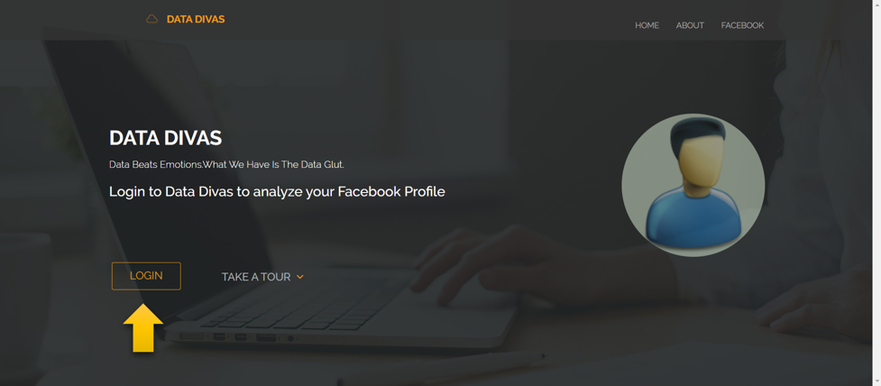
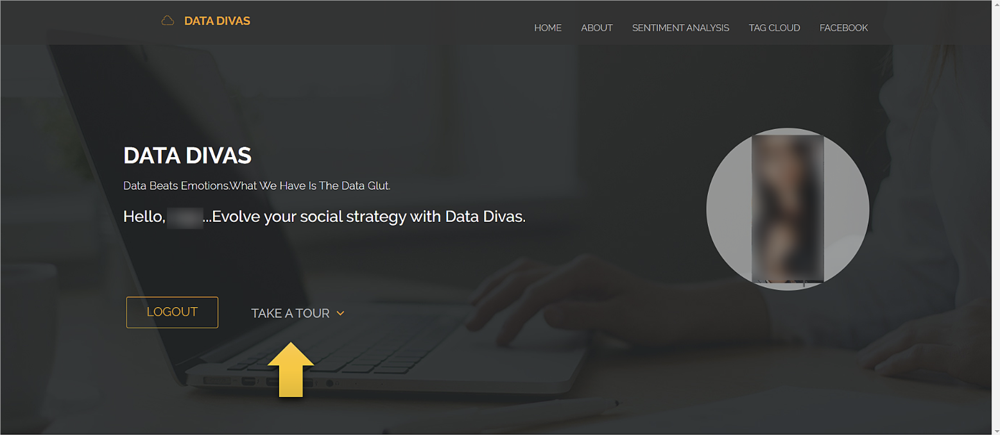
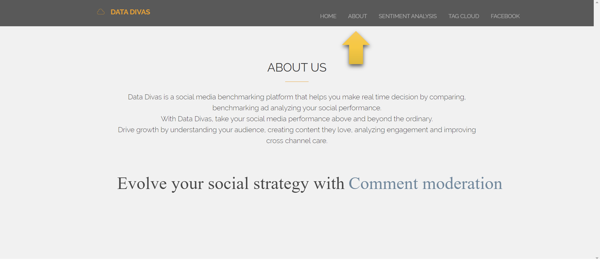
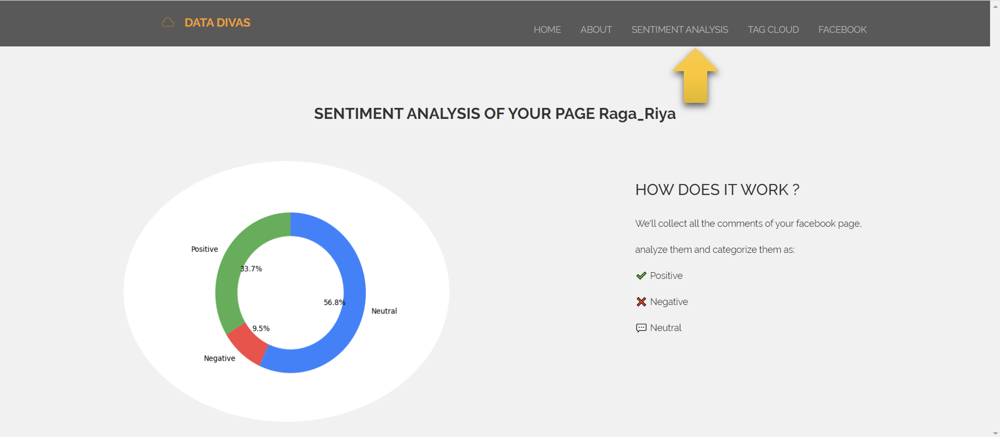
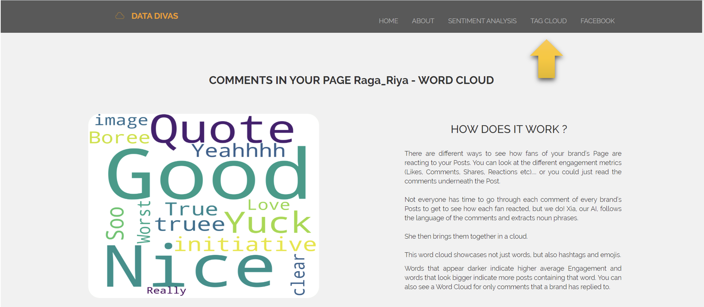

# Facebook Data Analysis

A web application that helps to identify the customer or follower's attitude towards the post.

It uses Django for backend and Django templates for frontend along with SQLite for database storage.This application uses Facebook graph API to retrieve all the comments of user's Facebook page, analyze them, categorize them using Text Blob and based on the sentimental analysis, it will visualize the results. Django auth is used to automate the Facebook login process.

### Snapshots of the web application

