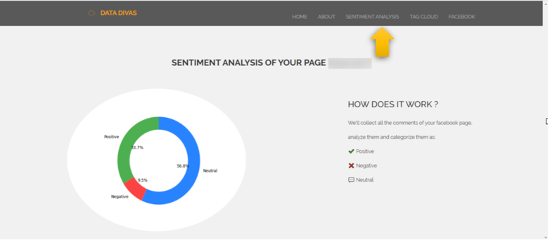

# Facebook Data Analysis

A web application that helps to identify the customer or follower's attitude towards the post.

It uses Django for backend and Django templates for frontend along with SQLite for database storage.This application uses Facebook graph API to retrieve all the comments of user's Facebook page, analyze them, categorize them using Text Blob and based on the sentimental analysis, it will visualize the results. Django auth is used to automate the Facebook login process.

### PROPOSED SYSTEM

### BACKEND SYSTEM - WORKING:
- User can log in to the Facebook data analyser website using Facebook login.
- While logging in, using the social auth pipeline, the dynamic user access token will be captured in backend.
- Since the validity of user access token will expire in fraction of seconds, the function written in backend uses the generated user access token to generate the long lived user access token.
- Using the long lived user access token, the next function will generate the long lived page access token to access the comments from user’s Facebook page.
- Once the page access token is generated, the Facebook Graph API is called using the access token.
- From the response of the API call, the comments of the page are retrieved using python query.
- Using Textblob, the queried comments are analysed and categorized into positive, negative and neutral comments.
- Finally, the result is visualized as a pie chart and word cloud.

### FRONTEND - WORKING:
- User enters into the website.
- User can login using Facebook (This will redirect to Facebook official login without saving any credentials in local database).
- Clicking on Sentimental analysis, the user can view the analysis result in terms of pie chart.
- Clicking on word cloud, the user can view all comments in terms of word cloud.
- Clicking on Log out will log out the user from the website.

### TECHNOLOGY STACK:
- Backend : Python, Django
- Frontend : Django template
- Software/IDE : Pycharm
- API : Facebook graph API
- Other tools : Facebook graph API explorer

### Snapshots of the web application

### REFERENCE:
- https://developers.facebook.com
- https://medium.com/@DrGabrielHarris/python-how-getting-facebook-data-and-insights-using-facebook-sdk-9de14d3c12fb#9072
- https://www.geeksforgeeks.org/generating-word-cloud-python/
- https://www.surinderbhomra.com/Blog/2016/06/26/Get-Facebook-Comments-For-A-Page-Using-Graph-API-In-ASPNET